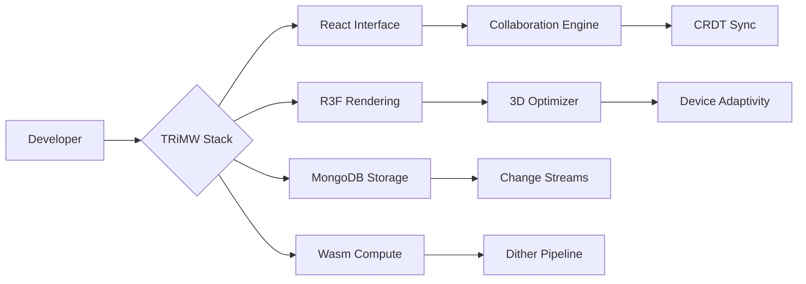
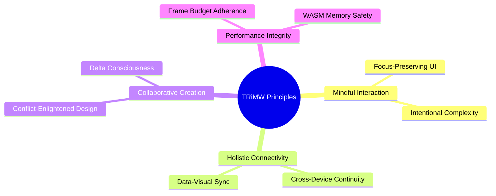
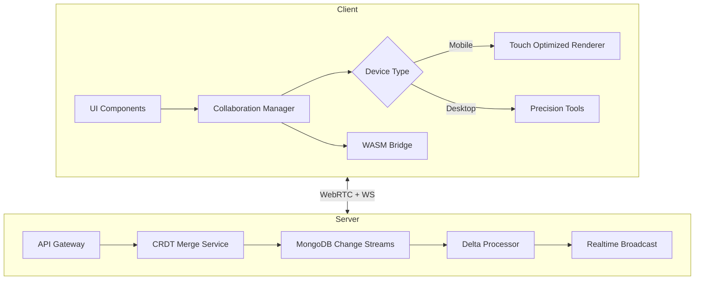
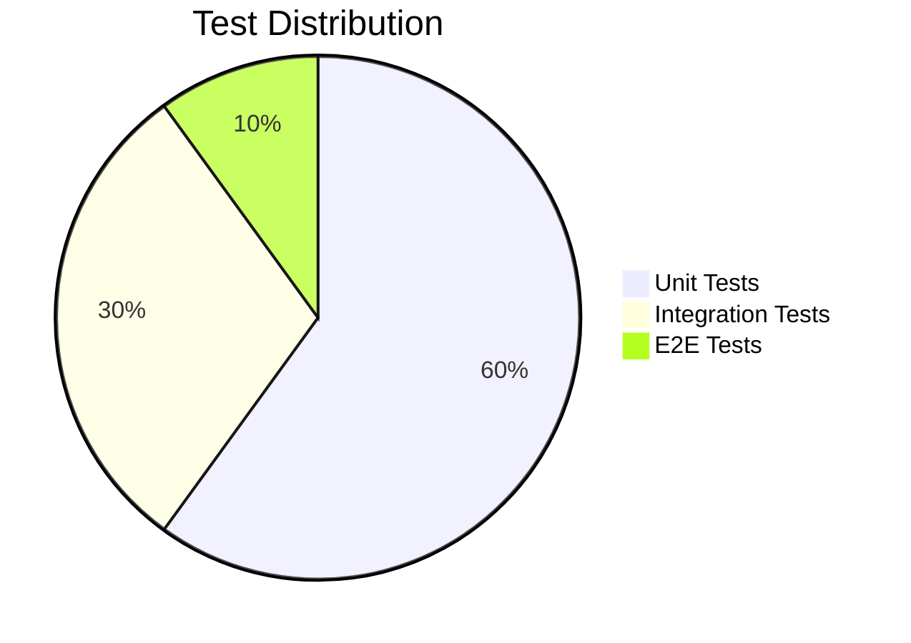
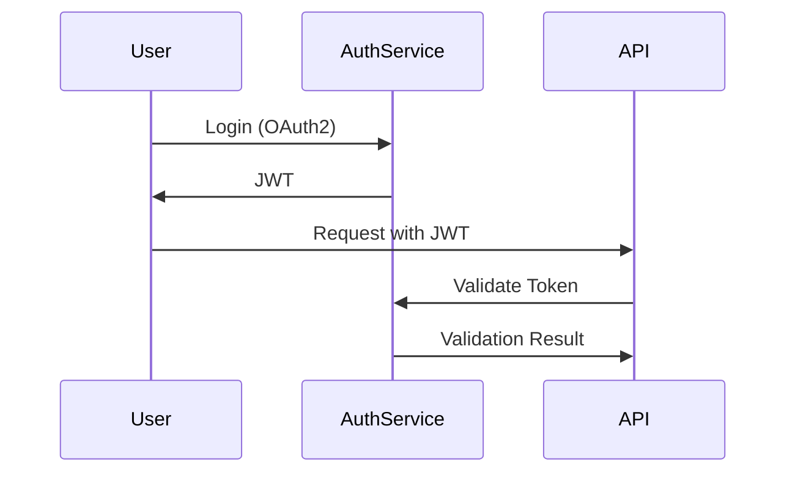

# **TRiMW Stack Complete Documentation**

---


**(T)hree.js + (R)eact + (M)ongoDB + (W)asm**

_Version 2.3 - Collaborative 3D Edition_



**Table of Contents**
```table-of-contents
```


**1.1 Design Principles**




## **1.2 Technology Choices**

|**Layer**|**Technology**|**Purpose**|
|---|---|---|
|**View**|React + R3F|Declarative 3D Interface|
|**State**|Yjs CRDTs|Collaborative State Management|
|**Network**|WebRTC + WebSocket|Real-Time Sync|
|**Storage**|MongoDB + Change Streams|Persistent Data Pipeline|
|**Compute**|Rust WASM|Performance-Critical Operations|
|**Auth**|OAuth2 + JWT|Secure Access Control|

##  **2. Architecture Overview**

  

### **2.1 Full System Diagram**



### **2.2 Component Matrix**

| **Component**     | **Responsibility**                 | **Tech Stack**         |
| ----------------- | ---------------------------------- | ---------------------- |
| **Canvas Core**   | 3D Rendering Pipeline              | Three.js, R3F, PostPro |
| **Dither Engine** | Pixel Art Conversion               | Rust WASM, WebGL2      |
| **Sync Service**  | Collaborative State Management     | Yjs, WebRTC, CRDTs     |
| **Asset Manager** | 3D Model Processing                | glTF, Draco, BasisU    |
| **Device Bridge** | Cross-Platform Input Normalization | React Input Lib        |

## **3. Development Setup**

  

### **3.1 Environment Requirements**

```Core Stack
Node.js 18.x
Rust 1.70+
MongoDB 6.0+
Docker 24.0+
```

# Recommended Tools

```
wasm-pack
@react-three/fiber
@react-three/drei
y-webrtc
```

### **3.2 Project Initialization**

```
git clone https://github.com/trimw-stack/trimw-collab
cd trimw-collab
```

## Install dependencies

```
npm install
cd wasm-modules && wasm-pack build --target web
cd ../server && cargo build --release
```

### Start development cluster

```

docker-compose -f dev-cluster.yml up -d
npm run dev
```

### **3.3 Configuration**
### .env.production

```
VITE_API_ENDPOINT=https://api.trimw.io
VITE_WS_ENDPOINT=wss://collab.trimw.io
VITE_WASM_PATH=/wasm
VITE_DITHER_CONFIG=standard
```

## **4. Core Components**

  
### **4.1 3D Scene Management**


// src/core/SceneManager.ts

---

```
class SceneManager {
  private scene: THREE.Scene;
  private composer: EffectComposer;
  
  constructor(canvas: HTMLCanvasElement) {
    this.scene = new THREE.Scene();
    this.composer = new EffectComposer(
      new WebGLRenderer({ canvas, antialias: true })
    );
    
    this.setupDitherPass();
  }

  private setupDitherPass() {
    const ditherPass = new ShaderPass(DitherShader);
    ditherPass.uniforms.palette.value = loadPalette();
    this.composer.addPass(ditherPass);
  }
}
```

#### **4.2 Collaborative Document Model**


// src/collab/CollabDoc.js

---
```
export class CollabDoc {
  constructor(roomId) {
    this.ydoc = new Y.Doc();
    this.provider = new WebRTCProvider(roomId, this.ydoc);
    this.undoManager = new Y.UndoManager(this.ydoc.getMap('scene'));
  }

  get sceneState() {
    return this.ydoc.getMap('scene').toJSON();
  }
}
```

## **5. Collaboration System**

  

### **5.1 Real-Time Sync Flow**

```sequenceDiagram
  participant UserA
  participant MergeService
  participant UserB
  
  UserA->>MergeService: Send Delta Update
  MergeService->>UserA: ACK
  MergeService->>UserB: Forward Delta
  UserB->>MergeService: Apply Confirmation
  MergeService->>UserA: Sync Complete
```

### **5.2 Conflict Resolution**

// server/src/crdt_merge.rs

---
```
impl ConflictResolver {
  pub fn resolve(&self, local: State, remote: State) -> State {
    match (local.timestamp, remote.timestamp) {
      (l, r) if l > r => local,
      (l, r) if r > l => remote,
      _ => self.merge_strategy.resolve(local, remote)
    }
  }
}
```

## **6. 3D Editor Implementation**

  

### **6.1 Dithering Pipeline**


// wasm-dither/src/lib.rs

---
```
#[wasm_bindgen]
pub fn apply_dither(buffer: &[u8], config: JsValue) -> Vec<u8> {
  let cfg: DitherConfig = config.into_serde().unwrap();
  let mut processor = DitherProcessor::new(cfg);
  processor.process(buffer)
}
```

### **6.2 Device-Specific Controls**


// src/controls/DeviceControls.ts

---
```
export const getControlScheme = (type: DeviceType) => {
  return {
    mobile: {
      rotate: 'twoFingerSwipe',
      scale: 'pinch',
      select: 'doubleTap'
    },
    desktop: {
      rotate: 'rightClickDrag',
      scale: 'mouseWheel',
      select: 'click'
    }
  }[type];
};
```

## **7. Data Management**

### **7.1 MongoDB Schemas**

// server/models/SceneSchema.js

---

```
const SceneSchema = new Schema({
  elements: [{
    type: { type: String, enum: ['model', 'light', 'camera'] },
    position: { x: Number, y: Number, z: Number },
    metadata: Map
  }],
  versions: [{
    hash: String,
    author: { type: Schema.Types.ObjectId, ref: 'User' },
    timestamp: Date
  }]
});
```

## **7.2 Change Stream Processing**

// server/changeStreams.js

```
MongoClient.watch([{
  $match: { operationType: { $in: ['insert', 'update'] } }
}]).on('change', (event) => {
  broadcastService.sendUpdate(event.fullDocument);
});
```

### **8. Performance Optimization**
#### **8.1 WASM Memory Management**


// wasm-memory/src/lib.rs

```
#[wasm_bindgen]
pub struct MemoryPool {
  buffer: Vec<u8>,
}

#[wasm_bindgen]
impl MemoryPool {
  pub fn new(size: usize) -> Self {
    let mut buffer = Vec::with_capacity(size);
    unsafe { buffer.set_len(size) };
    Self { buffer }
  }
}
```

#### **8.2 Three.js Optimization**


// src/optimization/SceneOptimizer.js

---

```
export function optimizeScene(scene) {
  scene.traverse(child => {
    if (child.isMesh) {
      child.geometry.computeBoundsTree();
      child.material = optimizeMaterial(child.material);
    }
  });
}
```

### **9. Testing Strategy**

#### **9.1 Testing Pyramid**



#### **9.2 Test Automation**

.github/workflows/tests.yml

---
```

jobs:
  test:
    runs-on: ubuntu-latest
    steps:
      - uses: actions/checkout@v3
      - uses: actions-rs/toolchain@v1
        with:
          profile: minimal
          toolchain: stable
      - run: cargo test --all-features
      - run: npm run test:ci
```

### **10. Deployment Guide**
#### **10.1 Kubernetes Setup**

 k8s/deployment.yml

---
```

apiVersion: apps/v1
kind: Deployment
spec:
  replicas: 3
  template:
    spec:
      containers:
      - name: trimw-server
        image: trimw-collab:latest
        ports:
        - containerPort: 8080
        envFrom:
        - configMapRef:
            name: trimw-config
```

#### **10.2 Monitoring Stack**

```
docker-compose -f monitoring.yml up -d
# Includes:
# - Prometheus
# - Grafana
# - Loki
# - AlertManager
```

### **11. Security Model**

#### **11.1 Authentication Flow**



#### **11.2 Security Audit Checklist**

```
- [ ] WebRTC Encryption Enabled
- [ ] WASM Memory Boundaries
- [ ] CRDT Merge Validation
- [ ] Input Sanitization
- [ ] Rate Limiting
- [ ] CORS Policy
```

### **12. API Reference**

#### **12.1 Core Endpoints**

| **Endpoint**     | **Method** | **Description**                 |
| ---------------- | ---------- | ------------------------------- |
| /api/scenes      | GET        | List available scenes           |
| /api/scenes/{id} | PUT        | Update scene metadata           |
| /ws/collab       | WS         | Real-time collaboration channel |

#### **12.2 WebSocket Events**

```
{
  "type": "deltaUpdate",
  "payload": {
    "operation": "addModel",
    "data": { /* ... */ }
  }
}
```

### **13. Troubleshooting**

#### **13.1 Common Issues**

| **Symptom**        | **Solution**                       |
| ------------------ | ---------------------------------- |
| WebGL Context Lost | Check memory usage, reduce quality |
| WASM Init Failure  | Verify wasm-pack build process     |
| Sync Conflicts     | Review CRDT merge strategy         |
| High Latency       | Enable WebRTC ICE candidates       |

#### **13.2 Diagnostic Commands**

###### WebGL Debugging

```
npm run debug:webgl
```

###### WASM Profiling

```
wasm-analyze ./public/wasm/*.wasm
```

###### Network Inspection

```
npm run proxy:capture
```

This complete documentation provides everything needed to develop, deploy, and maintain a TRiMW Stack application with collaborative 3D editing capabilities. For ongoing updates, refer to the [official GitHub repository](https://github.com/mcochranca/trimw-stack/docs).
